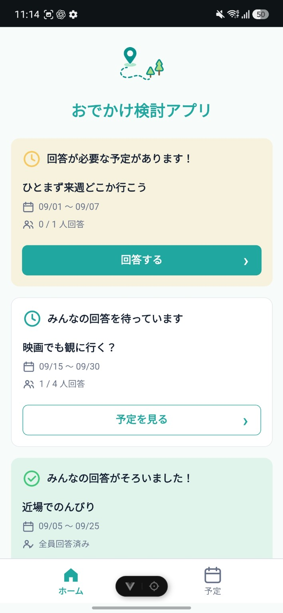
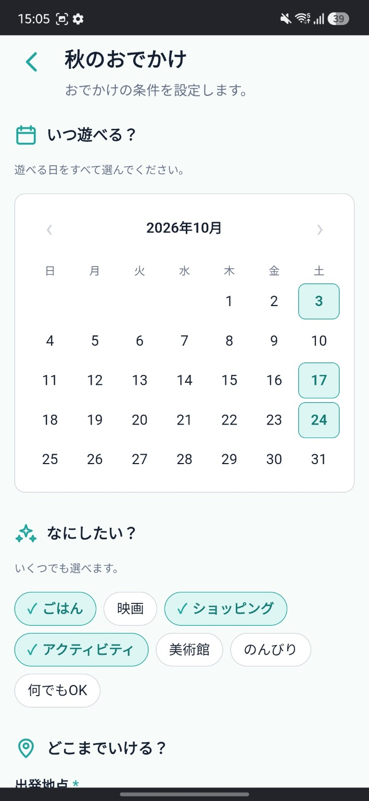
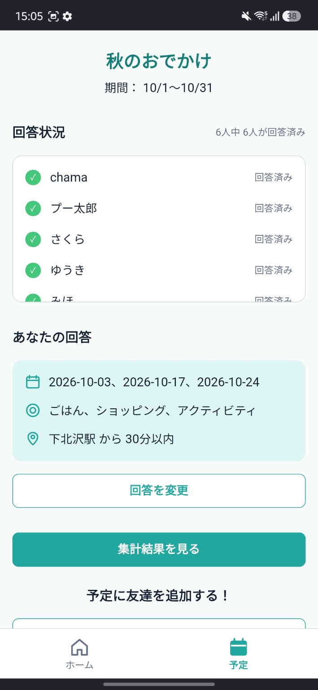
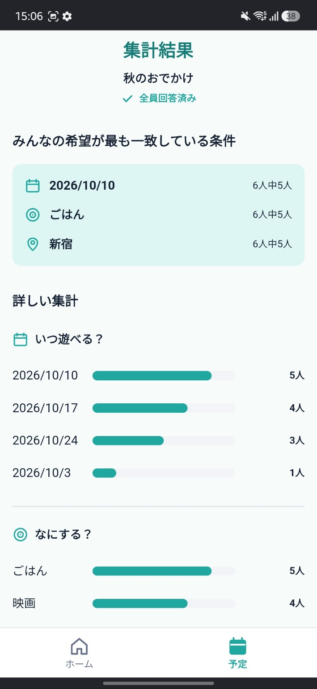

# おでかけ検討アプリ

複数人でのおでかけ予定を決めるときに、
「いつ遊ぶ？」「何をする？」「どこまで行ける？」といった希望を集め、
みんなの回答を比較・集計できるWebアプリです。

予定を作成して招待コードやURLを共有することで、
参加者それぞれが希望条件を回答できます。

回答が集まると、全員の希望が一致している条件や
候補ごとの回答人数を確認できます。

## 主な機能

- 初回利用時の表示名設定
- 予定の作成
- 招待コードによる予定への参加
- 招待URLの共有
- 希望日の複数選択
- やりたいことの複数選択
- 出発地点・移動可能時間・希望エリアの入力
- 回答内容の確認・変更
- 参加者の回答状況確認
- 希望条件の自動集計
- 全員一致している条件の表示
- 予定一覧
- 未回答・全員回答済み予定のお知らせ

## Screenshots

### 予定の状況をひと目で確認

<p align="center">
  
</p>

ホームでは、回答が必要な予定と全員の回答がそろった予定を分けて表示します。  
自分が次に何をすればよいかをひと目で確認でき、回答や集計結果へすぐにアクセスできます。

### それぞれの希望を回答

<p align="center">
  
</p>

参加者は候補日から参加できる日を選び、「なにしたい？」などのおでかけ条件を回答します。  
複数選択できる項目は、選択状態が直感的に分かるUIにしています。

### みんなの回答状況を確認

<p align="center">
  
</p>

予定ごとに参加者の回答状況を確認できます。  
自分の回答内容もまとめて表示し、回答後の確認や変更、集計結果への移動をひとつの画面から行えます。

### 希望の重なりを見つける

<p align="center">
  
</p>

参加者全員の回答を集計し、希望が最も一致している条件を表示します。  
候補ごとの回答人数も可視化することで、「全員一致ではないけれど、多くの人が希望している候補」まで比較できます。

## このアプリで解決したいこと

複数人で予定を決めるとき、
グループチャットではそれぞれの希望が複数のメッセージに分散し、
「結局いつなら全員空いているのか」
「何をしたい人が多いのか」
を整理する手間が発生します。

このアプリでは、予定ごとに回答項目を揃えることで、
参加者の希望を同じ形式で集め、
意思決定に必要な情報を一覧化できるようにしました。

## スマートフォンでの利用を前提に設計

友人同士でURLや招待コードを共有して利用する場面を想定し、
モバイル画面を中心にUIを設計しています。

## 使用技術

### Frontend

- Vue 3
- TypeScript
- Vite
- Vue Router
- Pinia
- SCSS

### Backend / Database

- Supabase
- PostgreSQL
- Supabase Auth
- Row Level Security (RLS)
- PostgreSQL Functions / RPC

## 認証

Supabase Anonymous Sign-Inを利用しています。

アカウント登録を必須にせず、
初回アクセス時に匿名ユーザーを作成することで、
すぐに予定作成・参加を開始できる構成にしています。

ユーザーの識別にはSupabase AuthのUIDを使用し、
表示名とは分離して管理しています。

## データベース

主に以下の3テーブルで構成しています。

### schedules

予定の基本情報を管理します。

- 予定名
- 候補期間
- 招待コード
- 作成者
- ステータス

### members

予定の参加者を管理します。

- 予定ID
- ユーザーID
- 表示名

`(schedule_id, user_id)` にUNIQUE制約を設定し、
同一ユーザーの重複参加を防止しています。

### responses

参加者の回答を管理します。

- 希望日
- やりたいこと
- 出発地点
- 移動可能時間
- 希望エリア

`(schedule_id, user_id)` にUNIQUE制約を設定し、
1ユーザーにつき1回答を保持します。

回答変更時は既存データを更新します。

## セキュリティ

SupabaseのRow Level Security（RLS）を使用し、
データベース側でもアクセス制御を行っています。

主な制御内容は以下です。

- 予定作成者本人による予定作成
- 本人による予定参加
- 本人による回答登録・更新
- 予定参加者のみ回答を閲覧可能
- 未参加ユーザーによる通常の予定取得を制限
- 招待コード検索は専用RPCを利用

フロントエンドの表示制御だけに依存せず、
DB側でもユーザーIDと予定への参加状態を検証する設計にしています。

## 招待コードによる参加

通常の予定データは参加者のみ取得できます。

そのため、未参加ユーザーが招待コードから予定を検索する処理には
PostgreSQL Function / RPCを使用しています。

招待コードから必要最小限の予定情報のみ取得し、
参加登録後は通常のRLSルールに従ってデータへアクセスします。

## テスト

主要機能について総合テストケースを作成しています。

主な確認対象：

- 初回利用
- 予定作成
- 招待
- 予定参加
- 回答
- 回答変更
- 予定詳細
- 集計
- RLS
- データ保持
- ブラウザ操作
- 入力境界値
- モバイルUI
- 異常系

デプロイ後には、
複数ブラウザ・複数ユーザーを利用したテストも実施予定です。

## セットアップ

### 1. パッケージのインストール

```sh
npm install
```

### 2. 環境変数

プロジェクト直下に `.env.local` を作成します。

```text
VITE_SUPABASE_URL=
VITE_SUPABASE_PUBLISHABLE_KEY=
```

Supabaseプロジェクトの値を設定してください。

### 3. 開発サーバー

```sh
npm run dev
```

### 4. 型チェック

```sh
npm run type-check
```

### 5. 本番ビルド

```sh
npm run build
```

## Development SQL

`sql/` 配下に、RLS適用用SQLと開発用テストデータを配置しています。

- `RLS_V2_APPLY.sql`
- `UI_TEST_DATASET_V2.sql`

テストデータSQLは、実行前にプレースホルダーを自分のテスト用値へ置換して使用します。

## 今後の改善予定

- 表示名を変更できる設定画面
- エラーメッセージ・通信エラー時UIの改善
- 予定管理機能の拡張
- RLSの追加ハードニング
- テスト自動化
- アクセシビリティの改善
- お出かけの予定を立てるための情報収集
- 予定日の天気予報や近辺のイベント情報表示
