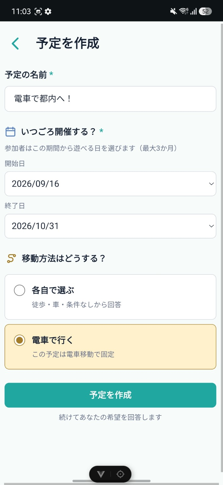
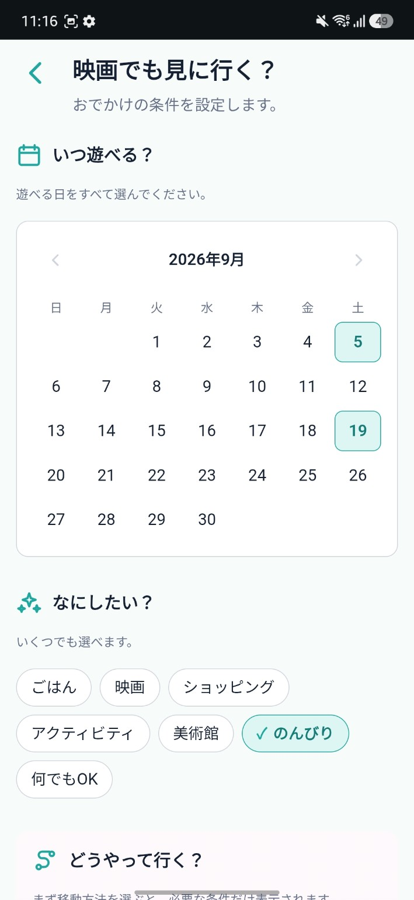
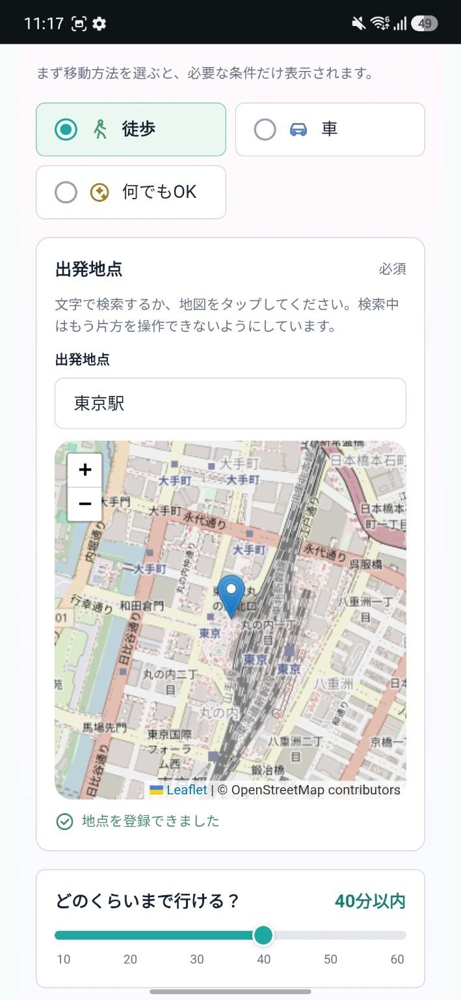
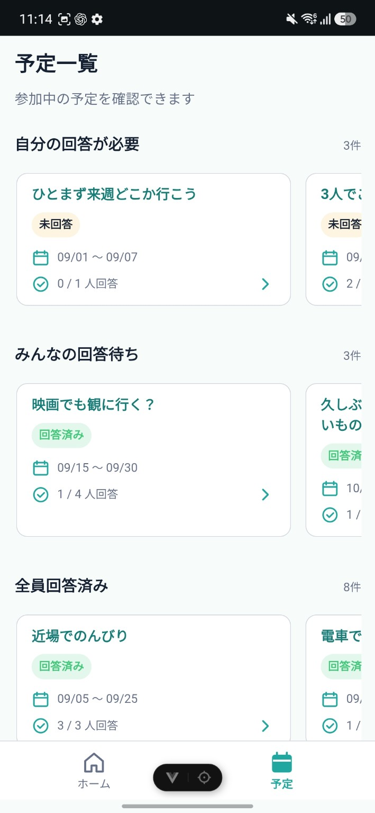
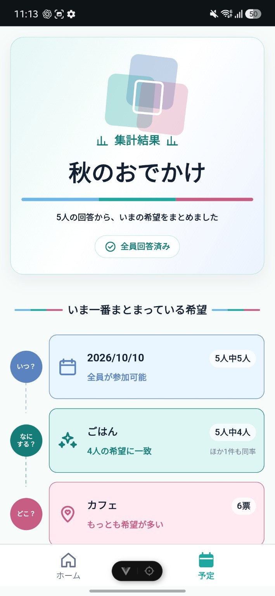
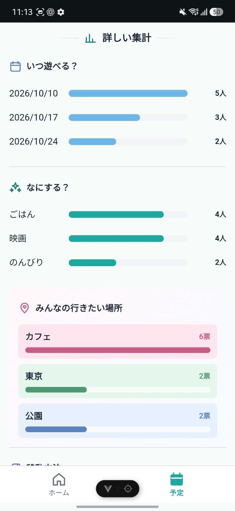
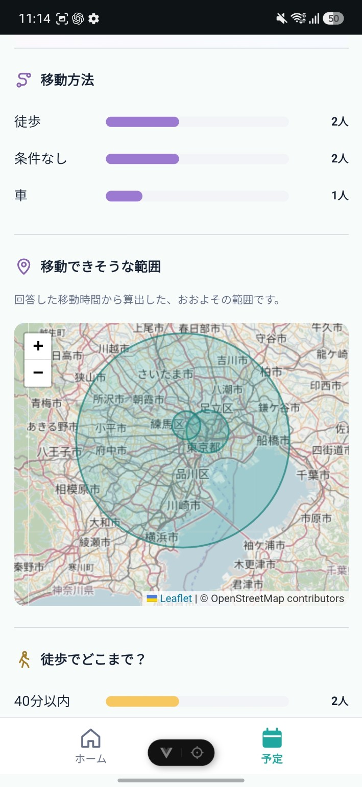

# おでかけ検討アプリ

複数人でのおでかけ予定を決めるときに、
「いつ遊ぶ？」「何をする？」「どこまで行ける？」といった希望を集め、
みんなの回答を比較・集計できるWebアプリです。

予定を作成して招待コードやURLを共有することで、
参加者それぞれが希望条件を回答できます。

回答が集まると、全員の希望が一致している条件や
候補ごとの回答人数を確認できます。

## 主な機能

- 初回利用時の表示名設定
- 予定の作成
- 招待コードによる予定への参加
- 招待URLの共有
- 希望日の複数選択
- やりたいことの複数選択
- 出発地点・移動可能時間・希望エリアの入力
- 回答内容の確認・変更
- 参加者の回答状況確認
- 希望条件の自動集計
- 全員一致している条件の表示
- 予定一覧
- 未回答・全員回答済み予定のお知らせ

## Screenshots

予定を作成し、参加者それぞれが希望を回答すると、その内容を予定ごとに確認・集計できます。  
ここでは、実際におでかけを決めていく流れに沿って主な画面を紹介します。

### 1. 予定を作る

<p align="center">
  
</p>

予定名と候補期間を設定し、予定を作成します。  
移動方法は「各自で選ぶ」または「電車で行く」から予定ごとに設定できます。

### 2. 希望を回答する

<table>
  <tr>
    <td align="center" width="50%">
      
    </td>
    <td align="center" width="50%">
      
    </td>
  </tr>
</table>

参加者は候補期間から遊べる日を選び、やりたいことや行きたい場所・ジャンルを回答します。  
各自で移動方法を選ぶ予定では、徒歩・車・条件なしから選択でき、必要な場合だけ出発地点と移動可能時間を入力します。出発地点は地図でも確認できます。

### 3. 今やることをホームで確認する

<p align="center">
  
</p>

ホームでは、予定を「自分の回答が必要」「みんなの回答待ち」「全員回答済み」の状態に応じて案内します。  
回答、予定詳細、集計結果など、その時点で自分に必要な操作へすぐ進めます。

### 4. 参加中の予定を探す

<p align="center">
  
</p>

予定一覧では、参加中の予定を回答状況ごとに整理して表示します。  
予定名・日程・回答進捗・自分の回答状態を確認しながら、目的の予定を探せます。

### 5. 回答状況と自分の回答を確認する

<p align="center">
  
</p>

予定詳細では、参加者の回答状況と自分が回答した内容をまとめて確認できます。  
回答の変更、集計結果の確認、友達の招待もこの画面から行えます。

### 6. みんなの希望を集計する

<table>
  <tr>
    <td align="center" width="33%">
      
    </td>
    <td align="center" width="33%">
      
    </td>
    <td align="center" width="33%">
      
    </td>
  </tr>
</table>

回答が集まると、「いつ？」「なにする？」「どこ？」それぞれで、いま最もまとまっている希望を確認できます。  
さらに候補ごとの人数・票数や移動方法を比較でき、徒歩・車の回答では出発地点と移動時間から算出したおおよその移動範囲も地図上に表示します。

## このアプリで解決したいこと

複数人で予定を決めるとき、
グループチャットではそれぞれの希望が複数のメッセージに分散し、
「結局いつなら全員空いているのか」
「何をしたい人が多いのか」
を整理する手間が発生します。

このアプリでは、予定ごとに回答項目を揃えることで、
参加者の希望を同じ形式で集め、
意思決定に必要な情報を一覧化できるようにしました。

## スマートフォンでの利用を前提に設計

友人同士でURLや招待コードを共有して利用する場面を想定し、
モバイル画面を中心にUIを設計しています。

## 使用技術

### Frontend

- Vue 3
- TypeScript
- Vite
- Vue Router
- Pinia
- SCSS

### Backend / Database

- Supabase
- PostgreSQL
- Supabase Auth
- Row Level Security (RLS)
- PostgreSQL Functions / RPC

## 認証

Supabase Anonymous Sign-Inを利用しています。

アカウント登録を必須にせず、
初回アクセス時に匿名ユーザーを作成することで、
すぐに予定作成・参加を開始できる構成にしています。

ユーザーの識別にはSupabase AuthのUIDを使用し、
表示名とは分離して管理しています。

## データベース

主に以下の3テーブルで構成しています。

### schedules

予定の基本情報を管理します。

- 予定名
- 候補期間
- 招待コード
- 作成者
- ステータス

### members

予定の参加者を管理します。

- 予定ID
- ユーザーID
- 表示名

`(schedule_id, user_id)` にUNIQUE制約を設定し、
同一ユーザーの重複参加を防止しています。

### responses

参加者の回答を管理します。

- 希望日
- やりたいこと
- 出発地点
- 移動可能時間
- 希望エリア

`(schedule_id, user_id)` にUNIQUE制約を設定し、
1ユーザーにつき1回答を保持します。

回答変更時は既存データを更新します。

## セキュリティ

SupabaseのRow Level Security（RLS）を使用し、
データベース側でもアクセス制御を行っています。

主な制御内容は以下です。

- 予定作成者本人による予定作成
- 本人による予定参加
- 本人による回答登録・更新
- 予定参加者のみ回答を閲覧可能
- 未参加ユーザーによる通常の予定取得を制限
- 招待コード検索は専用RPCを利用

フロントエンドの表示制御だけに依存せず、
DB側でもユーザーIDと予定への参加状態を検証する設計にしています。

## 招待コードによる参加

通常の予定データは参加者のみ取得できます。

そのため、未参加ユーザーが招待コードから予定を検索する処理には
PostgreSQL Function / RPCを使用しています。

招待コードから必要最小限の予定情報のみ取得し、
参加登録後は通常のRLSルールに従ってデータへアクセスします。

## テスト

主要機能について総合テストケースを作成しています。

主な確認対象：

- 初回利用
- 予定作成
- 招待
- 予定参加
- 回答
- 回答変更
- 予定詳細
- 集計
- RLS
- データ保持
- ブラウザ操作
- 入力境界値
- モバイルUI
- 異常系

デプロイ後には、
複数ブラウザ・複数ユーザーを利用したテストも実施予定です。

## セットアップ

### 1. パッケージのインストール

```sh
npm install
```

### 2. 環境変数

プロジェクト直下に `.env.local` を作成します。

```text
VITE_SUPABASE_URL=
VITE_SUPABASE_PUBLISHABLE_KEY=
```

Supabaseプロジェクトの値を設定してください。

### 3. 開発サーバー

```sh
npm run dev
```

### 4. 型チェック

```sh
npm run type-check
```

### 5. 本番ビルド

```sh
npm run build
```

## Development SQL

`sql/` 配下に、RLS適用用SQLと開発用テストデータを配置しています。

- `RLS_V2_APPLY.sql`
- `UI_TEST_DATASET_V2.sql`

テストデータSQLは、実行前にプレースホルダーを自分のテスト用値へ置換して使用します。

## 今後の改善予定

- 表示名を変更できる設定画面
- エラーメッセージ・通信エラー時UIの改善
- 予定管理機能の拡張
- RLSの追加ハードニング
- テスト自動化
- アクセシビリティの改善
- お出かけの予定を立てるための情報収集
- 予定日の天気予報や近辺のイベント情報表示
